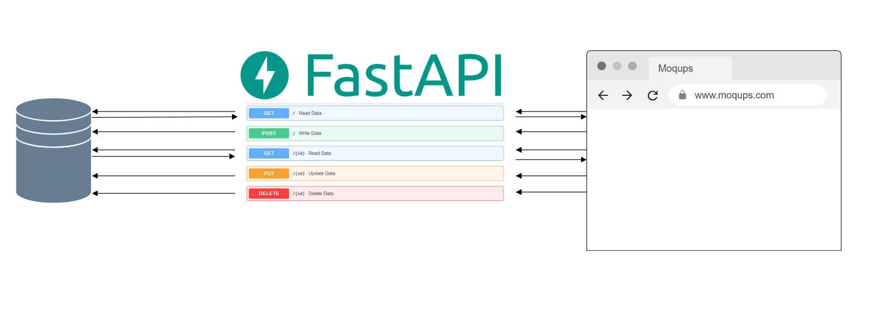

1 Введение
 
      1.Назначение
    
         Данная спецификация описывает функциональные и нефункциональные требования
         к программному продукту "Предсказатель". Этот документ предназначен для 
         разработчика, который будет реализовывать и проверять корректность работы
         программы. 

      2 Границы проекта 
        
        Проект предполагает создание фронтенда и бэкенда веб-приложения, оставляя за 
        рамками политическую деятельность партии предсказателей.

      3 Ссылки
        
        Информация к размышлению: https://prediction.org

2 Общее описание
 
     1.Общий взгляд на продукт

        Программный продукт "Предсказатель" представляет собой веб-приложение, 
        в котором по нажатию на соответствующий элемент интерфейса пользователь 
        получает случайный результат предсказания в виде предложения из текста 
        статей по саморазвитию. Цель - указать пользователю, на что обратить внимание.
        Общая схема функционирования:

     2 Классы и характеристики пользователей
        
| Класс пользователей | Описание                                                  |
|---------------------|-----------------------------------------------------------|
| Работодатели        | Все, для кого нужна демонстрация тестирования продукта    |
| Клиент              | Любой человек, ищущий мистические знаки в окружающем мире |
| Все остальные       | Случайные интернет-пользователи                           |
     
     3 Операционная среда

        Приложение предназначено для использования в любом современном браузере.
          
3 Пользовательские требования 

    3.1 User story: Как работодатель, я хочу видеть образец тестирования приложения

        Критерии приёмки: Приложение протестировано c надлежащим оформлением

        Заметки: тестовая документация должна лежать в корневой папке проекта

    3.2 User story: Как клиент я хочу иметь возможность получать цитаты по саморазвитию

        Критерии приёмки: Приложение отображает случайные цитаты по саморазвитию

        Заметки: отображение цитат в виде всплывающего окна

    3.3 User story: Как клиент я хочу иметь возможность заносить в текстовое поле
        свои цитаты и сохранять их для последующего использования  

        Критерии приёмки: В приложении есть текстовое поле для введения своего текста

        Заметки: поле ввода занимает большую часть экрана, а под полем кнопка подтверждения

    3.4 User story: как всем остальным, мне нужна возможность получить пожелание 
        добра перед закрытием вкладки с приложением

        Критерии приёмки: Все остальные получают позитив при закрытии приложения

        Заметки: не нужны

4 Системные функции

      4.1 Название первого функционального требования

         4.1.1 Описание

         4.1.2 Функциональные требования
            
| fff | fff |
|-----|-----|
| hh  | gg  |

      4.2 Название второго функционального требования

         4.2.1 Описание

         4.2.2 Функциональные требования

| fff | fff |
|-----|-----|
| hh  | gg  |

5 Требования к данным

      5.1 Логическая модель данных

      5.2 Словарь данных

6 Требования к внешним интерфейсам

      6.1 Пользовательские интерфейсы

      6.2 Интерфейсы ПО

7 Атрибуты качества

      7.1 Требования по удобству использования

      7.2 Требования к производительности

      7.3 Требования к безопасности

      7.4 Требования к доступности

      7.5 Требования к надежности

      7.6 Требования к переносимости

8 Требования по локализации и интернационализации

      8.1 Интернационализация

         Приложение должно отображать тексты на русском языке

      8.2 Локализация

         Приложение должно использовать локаль 'ru'

9 Требования к фронтэнду

      9.1 Бизнес-правила

      9.2 Технологический стек

      9.3 Дизайн

      9.4 UI и UX

      9.5 Работа с данными

      9.6 Сообщения и уведомления

      9.7 API и протоколы

      9.8 Обработка ошибок

      9.9 Работа в оффлайн-режиме

      9.10 Прототипы и макеты

10 Требования к бэкэнду

      10.1 Бизнес-правила

      10.2 Технологический стек

      10.3 Архитектура

         При создании приложения используется монолитная архитектура

      10.4 API и эндпоинты

      10.5 Работа с базой данных

      10.6 Аутентификация и авторизация 

