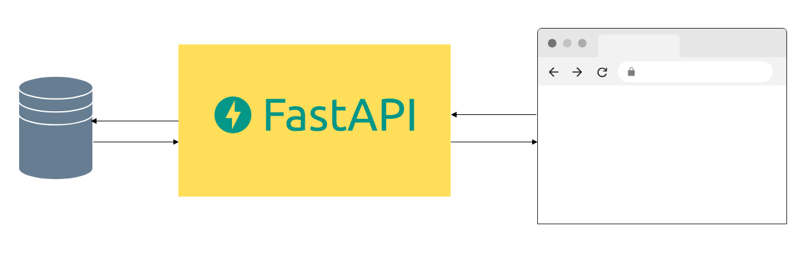
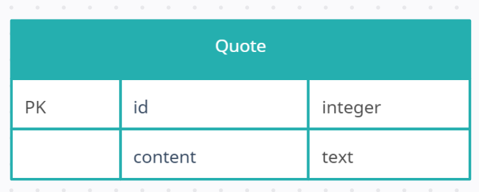

## 1 Введение
 
### 1 Назначение
    
Данная спецификация описывает функциональные и нефункциональные требования
к программному продукту "Предсказатель". Этот документ предназначен для 
разработчика, который будет реализовывать и проверять корректность работы
программы. 

### 2 Границы проекта 
        
Проект предполагает создание фронтенда и бэкенда веб-приложения, оставляя за 
рамками иную деятельность.

### 3 Ссылки
        
Информация к размышлению: https://okev.org/znachenie-citat-o-samorazvitii.html

## 2 Общее описание
 
### 1.Общий взгляд на продукт

Программный продукт "Предсказатель" представляет собой веб-приложение, 
в котором по нажатию на соответствующий элемент интерфейса пользователь 
получает случайный результат предсказания в виде цитаты из текста 
с темой саморазвития. Цель - указать пользователю, на что прежде всего обратить 
внимание в повседневной жизни.

### 2 Классы и характеристики пользователей
        
| Класс пользователей | Описание                                                  |
|---------------------|-----------------------------------------------------------|
| Работодатели        | Все, для кого нужна демонстрация тестирования продукта    |
| Клиент              | Любой человек, ищущий мистические знаки в окружающем мире |
| Все остальные       | Случайные интернет-пользователи                           |
     
### 3 Операционная среда

Приложение предназначено для использования в любом современном браузере.
          
### 3 Пользовательские требования 

#### 3.1 User story: 
Как работодатель, я хочу видеть образец тестирования приложения

#### Критерий приёмки: 
Приложение протестировано c надлежащим оформлением

#### Заметки: 
тестовая документация должна лежать в корневой папке проекта

#### 3.2 User story: 
Как клиент я хочу иметь возможность получать цитаты по саморазвитию

#### Критерий приёмки: 
Приложение отображает случайные цитаты по саморазвитию

#### Заметки: 
Отображение цитат в виде всплывающего окна

#### 3.3 User story: 
Как клиент я хочу иметь возможность узнать про создателей приложения

#### Критерии приёмки:
Приложение отображает информацию о разработчиках

#### Заметки:
Отображение информации о разработчиках

#### 3.4 User story: 
Как клиент я хочу иметь возможность заносить в текстовое поле свои цитаты и 
сохранять их для последующего использования  

#### Критерии приёмки: 
В приложении есть текстовое поле для введения своего текста

#### Заметки:
Поле ввода занимает левую половину экрана, а под ним кнопка подтверждения
    
#### 3.5 User story:
Как клиент я хочу иметь возможность видеть уже полученные цитаты   

#### Критерии приёмки: 
В приложении есть карточки с полученными цитатами

#### Заметки: 
Область с карточками занимает правую половину экрана

#### 3.6 User story: 
Как клиент я хочу иметь возможность удалять карточки с цитатами     

#### Критерии приёмки: 
В приложении есть возможность удалить карточку с цитатой

#### Заметки: 
Удаление происходит путём нажатия крестика в правом углу карточки
    
#### 3.7 User story:
Как клиент я хочу узнать, где находится создатель столь чудесного сервиса     

#### Критерии приёмки: 
В приложении есть страница с картой

#### Заметки:
На карте отмечено примерное местоположение разработчика 

#### 3.8 User story:
Как всем остальным, мне нужна возможность получить пожелание добра перед 
закрытием вкладки с приложением

#### Критерии приёмки: 
Все остальные получают позитив при закрытии приложения

#### Заметки:
Главное, не переборщить с позитивом

### 5 Требования к внешним интерфейсам

#### 5.1 Пользовательские интерфейсы

#### 5.2 Интерфейсы ПО

### 6 Атрибуты качества

#### 6.1 Требования по удобству использования

#### 6.2 Требования к производительности

#### 6.3 Требования к безопасности

#### 6.4 Требования к доступности

#### 6.5 Требования к надежности

#### 6.6 Требования к переносимости

### 7 Требования к интернационализации

      Приложение должно отображать тексты на русском языке

### 8 Общая схема
    

### 9 Требования к фронтэнду

#### 9.1 Бизнес-правила

| Идентификатор | Название     | Описание                                               |
|---------------|--------------|--------------------------------------------------------|
| 1             | Попап        | Размер всплывающего окна адаптируется к размеру цитаты |

#### 9.2 Технологический стек

В качестве фреймворка фронтенда используется Flutter

#### 9.3 Дизайн

Приложение должно быть красивым. Навигация общая с двумя кнопками сверху 
"Домой" и "О нас". На странице "Домой" должны быть поле ввода, кнопка 
подтверждения, карточки с полученными цитатами. На странице "О нас" должна
быть гугл-карта с местонахождением разработчика. Всплывающее окно всегда 
появляется по центру экрана   

#### 9.4 UI и UX

| №  | Содержание                                                                                             |
|----|--------------------------------------------------------------------------------------------------------|
| 1  | Размеры элементов адаптивные, поэтому не pixel perfect                                                 |
| 2  | Цвет фона страницы #EBEBEB                                                                             |
| 3  | У всех элементов, кроме карты, имеется фоновая тень непрозрачность 25, угол 120, дистанция 5, размер 5 |                                                                                |
| 4  | Радиус углов у всех элементов, кроме карты, 12                                                         |
| 5  | Окантовки у элементов отсутствуют                                                                      |
| 6  | Цвет фона кнопок навигации #FEF67F                                                                     |
| 7  | Шрифт на кнопках навигации Helvetica, размер 14                                                        |
| 8  | Состояние кнопок активное                                                                              |
| 9  | Шрифт в текстовом поле Helvetica, размер 24                                                            |
| 10 | Цвет кнопки получения #72BB53, шрифт 16                                                                |
| 11 | Цвет кнопки подтверждения #F06E9C                                                                      |
| 12 | Шрифт на кнопке подтверждения Helvetica, размер 14                                                     |
| 13 | Фон карточек справа от текстового поля, в которых сохраняются полученные цитаты, #FFFFFF               |
| 14 | Шрифт в карточках Helvetica, размер 14, цвет черный                                                    |
| 15 | Цвет фона всплывающего окна #FFC3AE                                                                    |
| 16 | Тень от всплывающего окна непрозрачность 25, угол 140, дистанция 20, размер 10                         |
| 17 | Шрифт текста во всплывающем окне Helvetica, размер 18                                                  |

#### 9.5 Работа с данными

Извлечение и сохранение цитат в базу данных

#### 9.6 Сообщения и уведомления

Сообщение в виде всплывающего окна

#### 9.7 Работа в оффлайн-режиме

Приложение не должно работать в оффлайн-режиме

#### 9.8 Прототипы и макеты

### 10 Требования к бэкэнду

#### 10.1 Бизнес-правила

| Идентификатор | Название     | Описание                                                |
|---------------|--------------|---------------------------------------------------------|
| 1             | Повтор цитат | Цитаты не повторяются                                   |

#### 10.2 Технологический стек

В качестве фреймворка для бэкенда используется FastApi

#### 10.3 Архитектура

При создании приложения применяется монолитная архитектура

#### 10.4 API и эндпоинты

#### 10.5 База данных

Используется база данных SQLite

#### 10.6 Логическая модель данных

#### 10.7 Аутентификация и авторизация 

Не требуется

### 11 Обработка ошибок