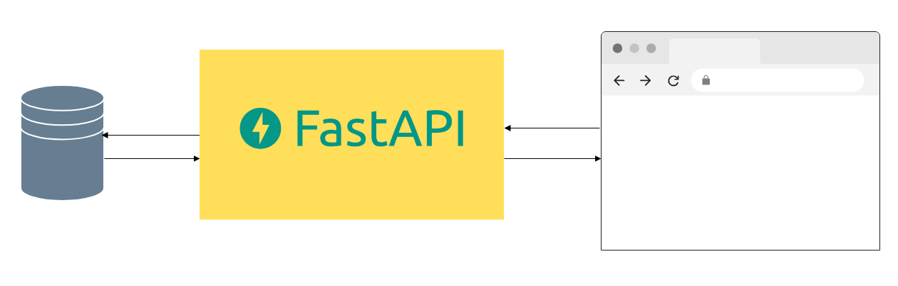
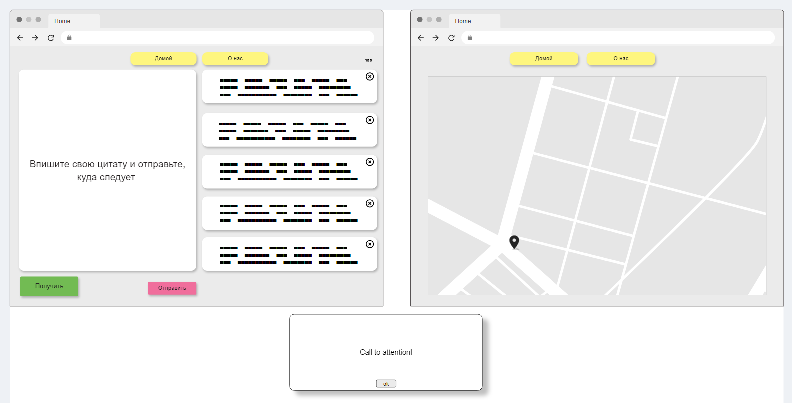
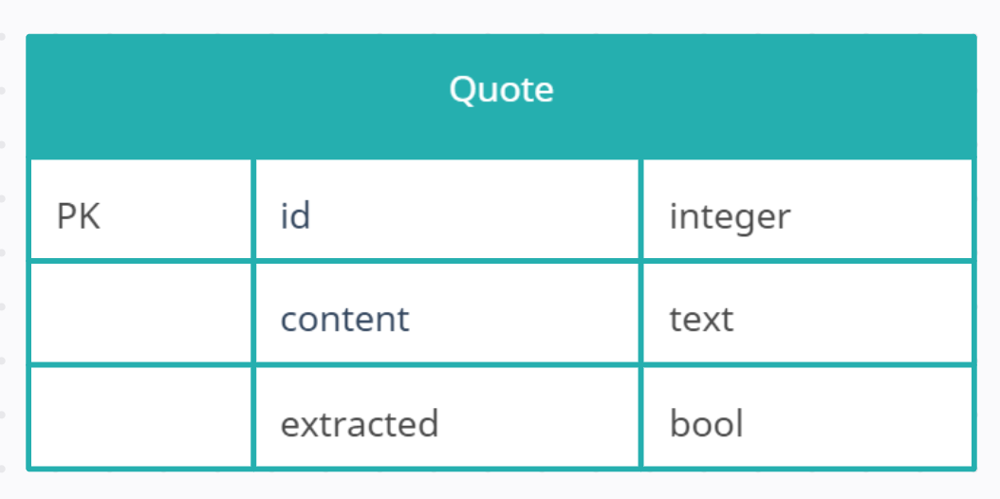

## 1 Введение
 
### 1 Назначение
    
Данная спецификация описывает функциональные и нефункциональные требования
к программному продукту "Оракул" (Oracle). Этот документ предназначен для 
разработчика, который будет реализовывать и проверять корректность работы
программы. 

### 2 Границы проекта 
        
Проект предполагает создание фронтенда и бэкенда веб-приложения, оставляя за 
рамками иную деятельность.


```regexp
Что представляет собой 'иная деятельность'? 
```

### 3 Ссылки
        
Информация к размышлению: https://okev.org/znachenie-citat-o-samorazvitii.html

```regexp
Зачем здесь эта информация?
```

## 2 Общее описание
 
### 1.Общий взгляд на продукт

Программный продукт представляет собой веб-приложение, 
в котором по нажатию на соответствующий элемент интерфейса пользователь 
получает случайный результат предсказания в виде цитаты из текста. Цель - указать
пользователю, на что прежде всего обратить внимание в повседневной жизни.

```regexp
текст должен быть определенной тематики или подойдет любой? 
```

### 2 Классы и характеристики пользователей
        
| Класс пользователей | Описание                                                 |
|---------------------|----------------------------------------------------------|
| Работодатель        | Все, для кого нужна демонстрация тестирования продукта   |
| Клиент              | Любой человек, ищущий 'знаки' в себе и окружающем мире   |
| Все остальные       | Случайные интернет-пользователи                          |
     
### 3 Операционная среда

Приложение предназначено для использования в браузере.

```regexp
Есть ли ограничения по модели и версии браузеров? 
```
### 3 Пользовательские требования 

#### 3.1 User story: 
Как работодатель, я хочу видеть образец тестирования приложения

#### Критерий приёмки: 
Приложение протестировано и тесты оформлены

#### Заметки: 
Тестовая документация должна лежать в корневой папке проекта

#### 3.2 User story: 
Как клиент, я хочу иметь возможность по запросу получать цитаты из текстов по саморазвитию

#### Критерий приёмки: 
Приложение по нажатию на кнопку отображает случайные цитаты и заносит их в текстовое поле

```regexp
Приложение по нажатию делает два действия одновременно? Или это разнесенные по
времени события?
```
#### Заметки: 
Отображение цитат в виде всплывающего окна

#### 3.3 User story: 
Как клиент, я хочу иметь возможность узнать про создателей приложения

#### Критерии приёмки:
Приложение отображает информацию о разработчике

```regexp
В каком виде информация?
```
#### Заметки:
Отображение информации о разработчиках

#### 3.4 User story: 
Как клиент, я хочу иметь возможность заносить в текстовое поле свои цитаты и 
сохранять их для последующего использования

#### Критерии приёмки: 
В приложении есть текстовое поле для введения своего текста

#### Заметки:
Поле ввода с кнопкой подтверждения занимает левую половину экрана

#### 3.5 User story:
Как клиент, я хочу иметь возможность видеть уже полученные цитаты   

#### Критерии приёмки: 
В приложении отображаются карточки с полученными цитатами. 

#### Заметки: 
Область с карточками в виде списка расположено в правой половине экрана

#### 3.6 User story:
Как клиент, я хочу иметь возможность прочитать уже полученную цитату полностью     

#### Критерии приёмки: 
В приложении отображается всплывающее окошко с полной цитатой. 

#### Заметки: 
Окошко всплывает при одинарном клике на карточку.
 
#### 3.7 User story:
Как клиент, я хочу иметь возможность редактировать карточку с цитатой     

#### Критерии приёмки: 
В приложении есть возможность редактировать карточку с цитатой

#### Заметки: 
Редактирование происходит путём двойного клика на карточку

#### 3.8 User story: 
Как клиент, я хочу иметь возможность узнать, сколько цитат сохранено в локальном хранилище

#### Критерии приёмки:
В приложении отображается количество сохранённых цитат

#### Заметки: 
Количество цитат отображается непосредственно справа над списком с карточками 

#### 3.9 User story: 
Как клиент, я хочу иметь возможность удалять карточки с цитатами     

#### Критерии приёмки: 
В приложении есть возможность удалить карточку с цитатой, при этом цитата
удаляется также и в базе данных

#### Заметки: 
Удаление карточек происходит путём нажатия крестика в правом углу карточки, а также смахиванием налево

### 6 Атрибуты качества

#### 6.1 Требования по удобству использования


| № | Требование                    | 	Описание                                                                                                                                                                                                                           |
|---|-------------------------------|-------------------------------------------------------------------------------------------------------------------------------------------------------------------------------------------------------------------------------------|
| 1 | Всё в один клик               | Пользователь должен иметь возможность сделать любое из возможных действий в один клик: запросить цитату, внести свою цитату, рассмотреть уже полученные цитаты, перейти к местонахождению разработчика, перейти на главную страницу |                            |
| 2 | Время отклика                 | Время отклика системы на любые действия пользователя должно быть небольше 1 секунды, кроме первоначального запуска.                                                                                                                 |
| 3 | Простота навигации            | Навигация должна содержать не более 2 кнопок                                                                                                                                                                                        |
| 4 | Сообщения об ошибках          | Все сообщения об ошибках должны быть понятны и указывать на конкретные действия по исправлению, см. п. Ошибки и исключения                                                                                                          |
| 5 | Доступность для читалок       | Все кнопки и текстовые элементы должны быть совместимы с программами экранного чтения.                                                                                                                                              |
| 6 | Изменение цитат               | Изменение осуществляется двойным кликом на карточке и последующим редактированием во всплывающем окне                                                                                                                               |
| 7 | Детальное рассмотрение цитат  | Чтобы рассмотреть цитату в карточке, на последней нужно кликнуть 1 раз, чтобы вызвать плавающее окошко с цитатой                                                                                                                    |

```regexp
2 Каким именно "небольшим" должно быть время запуска? Каким должно быть время "первоначального запуска"? В какой момент приложение считается запущенным?
3 Значит ли выражение "не более 2 кнопок", что кнопка может быть одна или не быть вообще?.
4 Здесь указан пункт об ошибках, но такого раздела с подробностями в спецификации нет
```
#### 6.2 Требования к производительности

Приложение должно быть достаточно производительным

```regexp
Что значит "достаточно"? Необходимы конкретные цифры и критерии. 
```

#### 6.3 Требования к безопасности

Цитаты не должны быть вредны для душевного здоровья пользователей. 

```regexp
Что значит "не должны быть вредны"? Какое воздействие на душевное здоровье считается вредным?
```
Прочие меры безопасности несущественны, поскольку система авторизации и аутентификации не предполагаются.

#### 6.4 Требования к доступности

Надписи на кнопках должны быть читабельными и должны прочитываться скринридерами. 

```regexp
Не хватает конкретики - в какой степени "читабельны"? Читабельны для специальных программ или для людей с минусовым зрением? 
Лучше из этого пункта сделать два требования 
```
#### 6.6 Требования к переносимости

Поскольку в качестве клиентской части используется кросс-платформенный фреймворк, специальная реализация переносимости не требуется 

### 7 Требования к интернационализации

Приложение должно отображать тексты на русском языке

### 8 Общая схема приложения
    


### 9 Требования к фронтэнду

#### 9.1 Бизнес-правила

| Идентификатор | Название            | Описание                                                                 |
|---------------|---------------------|--------------------------------------------------------------------------|
| 1             | Попап               | Размер всплывающего окна адаптируется к размеру цитаты                   |
| 2             | Количество карточек | Количество карточек зависит от того, сколько их запросит пользователь    |
| 3             | Повторение цитаты   | Цитаты не должны повторяться.                                            |
| 4             | Количество записей  | Пользователь может узнать, сколько цитат сохранено в локальном хранилище |
             
```regexp
2 При запросе большего количества карточек, что происходит?
3 Что значит "повторение цитаты"? Имеется в виду смысл цитаты или дословное совпадение? И как это реализуется?

```
#### 9.2 Технологический стек

В качестве фреймворка для фронтенда используется Flutter

#### 9.3 Дизайн

| № | Описание                                                                                                           |
|---|--------------------------------------------------------------------------------------------------------------------|
| 1 | Навигация в виде двух кнопок сверху "Домой" и "О нас".                                                             |
| 2 | На странице "Домой" должны быть поле ввода, кнопка запроса, кнопка подтверждения, карточки с полученными цитатами. |
| 3 | На странице "О нас" должна быть гугл-карта с местонахождением разработчика.                                        |
| 4 | Всплывающее окно всегда появляется по центру экрана                                                                |
| 5 | Всплывающее окно закрывается кликом на кнопку снизу по центру                                                      |
| 6 | Карточки реализованы в виде списка                                                                                 |
| 7 | Счетчик цитат находится над карточками справа                                                                      |
| 8 | При двойном клике на карточку всплывает окошко, где можно редактировать цитату                                     |
| 9 | При одинарном клике на карточку всплывает окошко, где можно прочитать всю цитату                                   |

```regexp
1 Где они расположены и на каком расстоянии друг от друга?
4 Всплывающее окно на какой странице? "Домой" или "О нас"? Какое именно всплывающее окно из двух или оба?

Не указано, как при первом запуске выглядит область страницы с карточками
```
#### 9.4 UI и UX

[чек-лист](check-list-requirements.md#проверка-uiux)

| №  | Описание элементов приложения                                                                          |
|----|--------------------------------------------------------------------------------------------------------|
| 1  | Размеры элементов адаптивные, поэтому не pixel perfect                                                 |
| 2  | Цвет фона страницы #EBEBEB                                                                             |
| 3  | У всех элементов, кроме карты, имеется фоновая тень непрозрачность 25, угол 120, дистанция 5, размер 5 |                                                                                |
| 4  | Радиус углов у всех элементов, кроме карты, 12                                                         |
| 5  | Окантовки у элементов отсутствуют                                                                      |
| 6  | Цвет фона кнопок навигации #FEF67F                                                                     |
| 7  | Шрифт на кнопках навигации Helvetica, размер 14                                                        |
| 8  | Состояние кнопок активное                                                                              |
| 9  | Шрифт в текстовом поле Helvetica, размер 24                                                            |
| 10 | Цвет кнопки получения #72BB53, шрифт 16                                                                |
| 11 | Цвет кнопки подтверждения #F06E9C                                                                      |
| 12 | Шрифт на кнопке подтверждения Helvetica, размер 14                                                     |
| 13 | Фон карточек справа от текстового поля, в которых сохраняются полученные цитаты, #FFFFFF               |
| 14 | Шрифт в карточках Helvetica, размер 14, цвет черный                                                    |
| 15 | Цвет фона всплывающего окна #FFFFFF                                                                    |
| 16 | Тень от всплывающего окна непрозрачность 25, угол 140, дистанция 20, размер 10                         |
| 17 | Шрифт текста во всплывающем окне Helvetica, размер 18                                                  |

#### 9.5 Работа с данными

Заключается в извлечении, сохранении и изменении цитат в базе данных

```regexp
Какие данные допустимы для ввода?
```
#### 9.6 Сообщения и уведомления

После нажатия на кнопку должно появляться сообщение с цитатой в виде всплывающего окна

#### 9.7 Работа в оффлайн-режиме

В отсутствии интернета приложение показывает уже имеющиеся цитаты, а новые запросить нельзя

#### 9.8 Макет
[чек-лист](check-list-requirements.md#проверка-дизайна)



```regexp
На макете нет счётчика цитат в локальном хранилище
```
#### 9.9 Обработка ошибок

Сообщения об ошибках в виде всплывающих окон

```regexp
Отсутствует раздел об ошибках и исключениях
```
```regexp
Нет раздела про хостинг фронтенд части приложения
```

### 10 Требования к бэкэнду

#### 10.1 Бизнес-правила

| Идентификатор | Название            | Описание                                                                       |
|---------------|---------------------|--------------------------------------------------------------------------------|
| 1             | Повтор цитат        | Цитаты не должны повторятся                                                    |
| 2             | Удаление записей    | При удалении карточки с цитатой удаляется соответствующая запись в базе данных |
| 3             | Начальное состояние | Изначально в базе данных уже должно быть 40 цитат                              |
```regexp
Каким образом это контролируется? Оправданно ли это с позиций производительности?
```
#### 10.2 Технологический стек

В качестве фреймворка для бэкенда используется FastApi

#### 10.3 Архитектура

При создании приложения применяется монолитная архитектура

#### 10.4 API и эндпоинты

[чек-лист](check-list-requirements.md#api)

[API](../doc-data/api.yaml) - схема апи 

```regexp
У эндпоинта в схеме openapi отсутствуют responses с ошибками
В схеме API отсутствуют описания для эндпоинтов delete и patch
Отсутствует максимальное и минимальное количество допустимых символов в поле content
В схеме отсутствуют эндпоинты patch /api/prophecy, patch /api/prophecy/[id] и delete /api/prophecy/[id] 
```
#### 10.5 Модель данных

Данные пересылаются по сети в формате JSON

#### 10.6 База данных

Используется база данных

```regexp
Какая именно база данных или любая?
Стоит указать сколько записей допустимо хранит в базе данных и сколько занесено по умолчанию 
```

#### 10.7 Логическая модель базы данных

[чек-лист](check-list-requirements.md#данные)



#### 10.8 Аутентификация и авторизация 

Не требуется


```regexp
Отсутствует раздел об ошибках и исключениях 
```
```regexp
Нет раздела про хостинг бекенд части приложения
```
